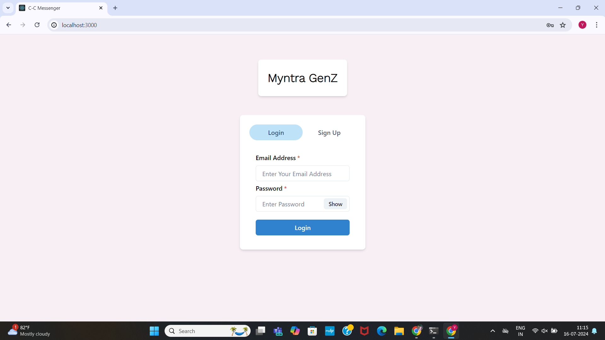

# Myntra GenZ Bestie Chat Group Feature (Team CODE DIVAS)

Myntra GenZ Bestie Chat Group is an innovative feature designed to enhance the social shopping experience. It allows users to share their favorite products with friends, engage in real-time conversations, and receive instant feedback directly within the Myntra platform.

## Key Features

1. **Social Shopping Integration**: Share products with friends using the "My Bestie" option.
2. **Real-Time Chat**: Powered by Socket.IO for instant messaging and notifications.
3. **User Groups**: Create and manage groups to discuss products and get opinions.
4. **Profile Management**: View and edit profile details, including the ability to upload pictures.
5. **Seamless Login**: Register and login to access the full suite of features with MongoDB storing user details.

## Problem Statement

Young fashion enthusiasts seek instant feedback and validation from their peers, but switching between apps for opinions is cumbersome and disrupts the shopping experience. Myntra's current platform does not fully resonate with Gen Z and fast fashion enthusiasts due to a lack of community-building features like user groups for sharing reviews and recommendations. There is a need for a seamless, integrated solution within the Myntra app to better connect with younger audiences, foster a sense of community, and increase user retention.

## Proposed Solution

The GenZ Bestie Chat Group feature provides a seamless way for users to share products and chat with friends directly on Myntra. This integration enhances user engagement and makes the shopping process more interactive and enjoyable.

## Tech Stack

- **Frontend**: React for the user interface.
- **Backend****: Node.js with Express for server-side logic.
- **Database**: MongoDB for storing user data.
- **Real-Time Communication**: Socket.IO for real-time messaging.

## Installation

### Prerequisites

- Node.js and npm installed
- MongoDB set up and running

### Steps

1. Clone the repository:

   ```bash
   git clone https://github.com/YakshineAnannyaGudapati/Myntra_Hackerramp.git
   ```

2. Navigate to the project directory in the MyntraClone:

   ```bash
   cd Frontend
   ```

3. Install dependencies:

   ```bash
   npm install
   ```

4. Set up DB Connection:

   Connect to the `//localhost:27017/`

5. Start the development server (Landing page will be opened in the localhost:3000):

   ```bash
   npm start
   ```

6. In a new terminal, navigate to the project directory of chat app frontend and backend through the following commands and install the dependencies:

   ```bash
   cd myapp
   ```

   ```bash
   cd backend
   ```

7. Start the development server in the localhost:3001:

   ```bash
   npm start
   ```

## Usage

1. Register or log in to the platform.
2. Browse products and click the "Share" button to share with friends.
3. Engage in real-time chats and get feedback on your selections.
4. Manage your profile and groups from the user dashboard.

## Workflow End to End
### Landing Page

### Browsing Products

### Share Option(If user already registered and created user group)

### Group Chat among friends


### If user not yet registered




### User can check profile


### Create Groups


### Real-Time Chat along with notification


## Team Members
1.**Yakshine Anannya Gudapati**
2.**Uma Subhashini Ravuri**
3.**Sree Greeshma Achanta**


## License

This project is licensed under the MIT License. See the `LICENSE` file for details.


